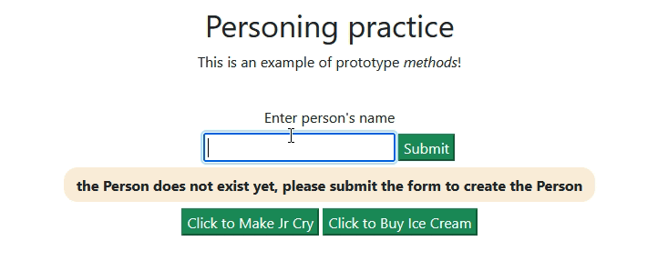

# Prototypes and Classes in Javascript

## Description

This is for demonstration purposes. 

The main branch of this repo uses two prototype constructors, each with it's own method. A simple form can take a name and create both objects, with one set as a property of the other. You can click the buttons to call their methods. 

The parent-child branch has examples of similar functionality using ES6 classes. 



### Setup

- Clone:

```
git clone https://github.com/epicodus-lessons/teacher-prototype-methods-and-class.git
```

- open `index.html`

**OR**

- Run in [VsCode live server](https://marketplace.visualstudio.com/items?itemName=ritwickdey.LiveServer) 

## Resource Links
What is a prototype in Javascript? - [MDN Object Prototypes](https://developer.mozilla.org/en-US/docs/Learn/JavaScript/Objects/Object_prototypes)

What is a class in javascript? - [W3Schools Javascript classes](https://www.w3schools.com/jsref/jsref_classes.asp)

Template literals - [MDN template literals](https://developer.mozilla.org/en-US/docs/Web/JavaScript/Reference/Template_literals)

## License

<summary>
Copyright 2022 Epicodus
  <details>
    Permission is hereby granted, free of charge, to any person obtaining a copy of this software and associated documentation files (the "Software"), to deal in the Software without restriction, including without limitation the rights to use, copy, modify, merge, publish, distribute, sublicense, and/or sell copies of the Software, and to permit persons to whom the Software is furnished to do so, subject to the following conditions:

    The above copyright notice and this permission notice shall be included in all copies or substantial portions of the Software.

    THE SOFTWARE IS PROVIDED "AS IS", WITHOUT WARRANTY OF ANY KIND, EXPRESS OR IMPLIED, INCLUDING BUT NOT LIMITED TO THE WARRANTIES OF MERCHANTABILITY, FITNESS FOR A PARTICULAR PURPOSE AND NONINFRINGEMENT. IN NO EVENT SHALL THE AUTHORS OR COPYRIGHT HOLDERS BE LIABLE FOR ANY CLAIM, DAMAGES OR OTHER LIABILITY, WHETHER IN AN ACTION OF CONTRACT, TORT OR OTHERWISE, ARISING FROM, OUT OF OR IN CONNECTION WITH THE SOFTWARE OR THE USE OR OTHER DEALINGS IN THE SOFTWARE.

  </details>
</summary>


## Acknowledgments

Inspiration, code snippets, etc.
* [awesome-readme](https://github.com/matiassingers/awesome-readme)