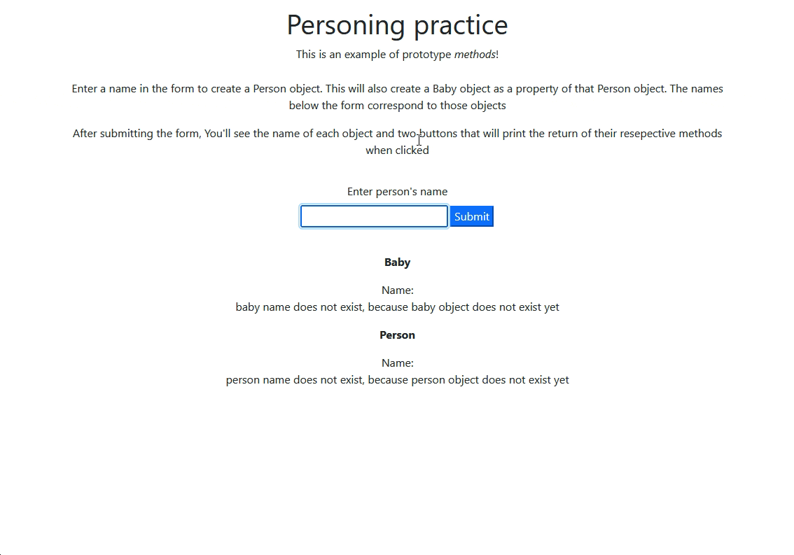

# Prototypes and Classes in Javascript

TODO:
I see how this is working in the scripts, but I would add more in the DOM to illustrate that when you are filling out the form it is actually creating two different objects (person and baby) with the same name and that each function is specifically for the corresponding object. This might be more helpful for students to understand what exactly is happening. Just my two cents.

Hey Patrick, I just reviewed the scripts.js file and commentary. Looks good to me! If the goal is highlighting that an object and another object nested inside of it doesn't necessarily share functionality, I think you've done that. Meaning, the baby object is nested in the parent object, but the parent object can't cry, only the baby object can cry. I got this main takeaway from the very last commentary in the scripts.js. Am I on the right track?

I have these suggestions for your consideration:
- consider not using template literals if students haven't been exposed to them yet in the curriculum. I don't think it's bad to introduce them now, but sometimes introducing something new can distract from the point of the lesson in this example. This is entirely up to your discretion.
- consider setting a line length for comments and manually wrapping them onto multiple lines. Doing this makes commentary and code easier for me to read, because I don't have to scroll from side to side when viewing the file on GitHub.com. This is just a personal preference.
- I see you add links that students can visit to learn the difference between classes and prototypes. It could be helpful to label the link to classes as optional further exploration and to include a clear statement that JS uses object types and prototypal inheritance, and that students will learn about class syntax later on. Suggesting this, because it could help some students parse which information they need to focus their brains on, and which is extra

## Description

This is for demonstration purposes. 

The main branch of this repo uses two prototype constructors, each with it's own method. A simple form can take a name and create both objects, with one set as a property of the other. You can click the buttons to call their methods. 

The parent-child branch has examples of similar functionality using ES6 classes. 



### Setup

- Clone:

```
git clone https://github.com/epicodus-lessons/teacher-prototype-methods-and-class.git
```

- open `index.html`

**OR**

- Run in [VsCode live server](https://marketplace.visualstudio.com/items?itemName=ritwickdey.LiveServer) 

## Resource Links
What is a prototype in Javascript? - [MDN Object Prototypes](https://developer.mozilla.org/en-US/docs/Learn/JavaScript/Objects/Object_prototypes)

What is a class in javascript? - [W3Schools Javascript classes](https://www.w3schools.com/jsref/jsref_classes.asp)

Template literals - [MDN template literals](https://developer.mozilla.org/en-US/docs/Web/JavaScript/Reference/Template_literals)

## License

<summary>
Copyright 2022 Epicodus
  <details>
    Permission is hereby granted, free of charge, to any person obtaining a copy of this software and associated documentation files (the "Software"), to deal in the Software without restriction, including without limitation the rights to use, copy, modify, merge, publish, distribute, sublicense, and/or sell copies of the Software, and to permit persons to whom the Software is furnished to do so, subject to the following conditions:

    The above copyright notice and this permission notice shall be included in all copies or substantial portions of the Software.

    THE SOFTWARE IS PROVIDED "AS IS", WITHOUT WARRANTY OF ANY KIND, EXPRESS OR IMPLIED, INCLUDING BUT NOT LIMITED TO THE WARRANTIES OF MERCHANTABILITY, FITNESS FOR A PARTICULAR PURPOSE AND NONINFRINGEMENT. IN NO EVENT SHALL THE AUTHORS OR COPYRIGHT HOLDERS BE LIABLE FOR ANY CLAIM, DAMAGES OR OTHER LIABILITY, WHETHER IN AN ACTION OF CONTRACT, TORT OR OTHERWISE, ARISING FROM, OUT OF OR IN CONNECTION WITH THE SOFTWARE OR THE USE OR OTHER DEALINGS IN THE SOFTWARE.

  </details>
</summary>


## Acknowledgments

Inspiration, code snippets, etc.
* [awesome-readme](https://github.com/matiassingers/awesome-readme)